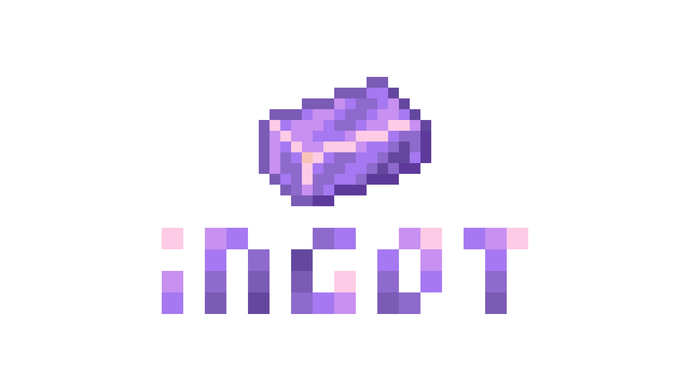

  
  <h1 class="ingot-hero-title">ingot</h1>
  

    A C# framework to programmatically create Minecraft Bedrock Edition packs.
    Define blocks, items, entities, recipes, and loot tables in strongly-typed C# instead of hand-writing JSON.
  

  

    <a class="ingot-btn ingot-btn-primary" href="docs/getting-started.html">Get Started</a>
    <a class="ingot-btn ingot-btn-secondary" href="api/ingot.Core.html">API Reference</a>
    <a class="ingot-btn ingot-btn-secondary" href="https://github.com/pyroboots/ingot">GitHub</a>
  

<h2 class="ingot-section-title">Documentation</h2>

  <a class="ingot-card" href="docs/getting-started.html">
    
Getting Started

    
Install ingot, define your first content, compile a pack, and load it in-game.

  </a>
  <a class="ingot-card" href="docs/trait-system.html">
    
Trait System

    
Compose block, item, and entity behaviour from strongly-typed C# interfaces.

  </a>
  <a class="ingot-card" href="docs/resource-packs.html">
    
Resource Packs & Textures

    
Textures, geometry, pack icons, and the behaviour/resource bridge.

  </a>
  <a class="ingot-card" href="docs/script-services.html">
    
Script Services

    
Tick-based Script API modules for global game logic.

  </a>

<h2 class="ingot-section-title">Content Guides</h2>

  

    <a class="ingot-card-title-link" href="docs/block.html">Blocks</a>
    
States, traits, material instances, and loot tables.

    <ul class="ingot-card-sub">
      <li><a href="docs/block-permutations.html">Permutations</a></li>
      <li><a href="docs/block-mat-instances.html">Material Instances</a></li>
      <li><a href="docs/block-events.html">Block Events</a></li>
    </ul>
  

  

    <a class="ingot-card-title-link" href="docs/item.html">Items</a>
    
Icons, traits, creative menu placement, and crafting integration.

    <ul class="ingot-card-sub">
      <li><a href="docs/item-events.html">Item Events</a></li>
      <li><a href="docs/recipe.html">Recipes</a></li>
      <li><a href="docs/loot-table.html">Loot Tables</a></li>
    </ul>
  

  

    <a class="ingot-card-title-link" href="docs/entity.html">Entities</a>
    
Mob traits, behaviour presets, component groups, and events.

    <ul class="ingot-card-sub">
      <li><a href="docs/entity-component-groups.html">Component Groups</a></li>
      <li><a href="docs/entity-events.html">Entity Events</a></li>
    </ul>
  

  <a href="https://github.com/pyroboots/ingot/blob/master/README.md">Project README</a>
  &nbsp;&middot;&nbsp;
  <a href="https://github.com/users/pyroboots/projects/4">Todo List</a>

